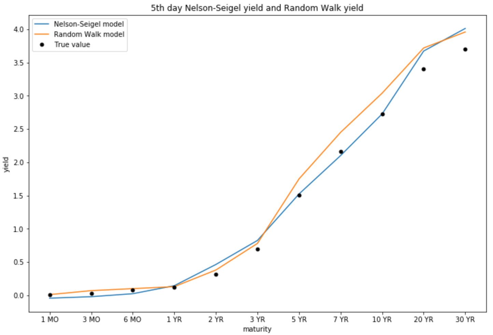

# fix-income-quant-trading
some interest rate models such as Vasicek model

## Vasicek model

=\{\mu-\kappa r(t)\}dt+\sqrt{\gamma r(t)+\sigma} dW(t)})

when $\gamma$ is zero

## Dynamic Nelson-Siegel

Carry out estimation of DNS parameters

