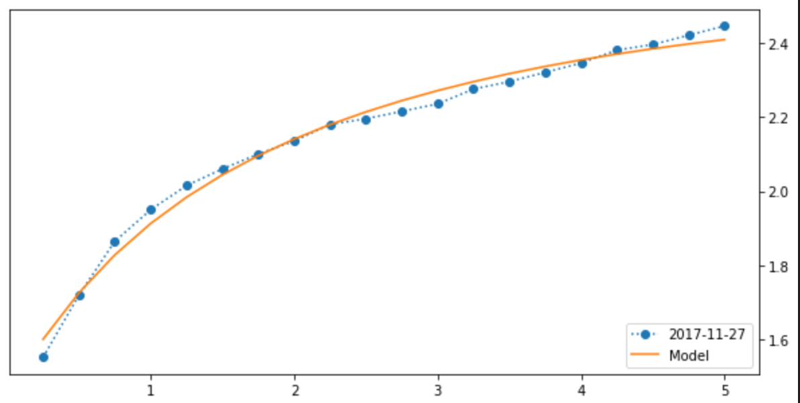

# fix-income-quant-trading
some interest rate models such as Vasicek model

## Vasicek model

$$dr(t)=\{\mu-\kappa r(t)\}dt+\sqrt{\gamma r(t)+\sigma} dW(t)$$

when $\gamma$ is zero

## Dynamic Nelson-Siegel

Carry out estimation of DNS parameters

